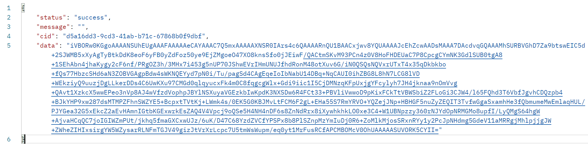
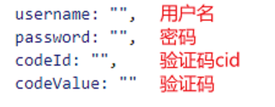
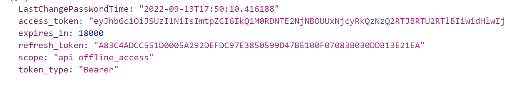

### 学到的知识点小计
  ####  接口相关
    - 目前拿到了两个接口 一个是验证码接口 另一个是登录接口 
	- /api/Home/GetVerifyCode GET 后端的地址是 http://192.168.1.9:8200
	- 还有一个接口是 登录接口 oauth/connect/token 
	- 针对请求到的数据 需要贴上具体的截图 
	- 对于请求到的数据 涉及到两个问题 一个是跨域的问题 
			- 还有关于测试调试接口用到的软件 我也有了初步的了解 但是对于后端请求接口 用postman 进行调试 还是有一定的问题 针对这个点 我感觉可以在深入的了解一下。
	- 验证码接口请求回来的数据
对于登录接口 它的请求方法是 post 对于 config 里面传的参数 被给到了一个字段 。
	- 具体的字段请参照下面的截图
	
	根据字段名称 发送响应的参数 
	- 对于密码 需要安装一个插件 md5 把对应的密码进行加密 
	- 对于post请求 还要额外的加字段 进行 传递数据 

####  对于接口的封装还有调用  需要 配置 axios
 - 注意 要额外注意跨域的问题  另外还有一个问题 就是 proxy代理的问题 目前解决跨域问题主要是 使用proxy代理
 - 目前还没有测试的接口是 登录接口 主要出现的问题是 接口 请求不到数据 我就很 emmmmm
 

- js 的入门
-  es6 
  关于这两个部分我欠缺的还是有一点多  这就是很惨了啊
  - 那就浅浅的发散一下‘
  - 那什么
  - 首先 是创建一个新的对象 
  - 比如说 axios新创建的config 实例 就是一个对象
  -  那怎么给对象添加一个新的属性呢

- 既然项目出现了问题 那就不要寄希望于别人可以帮你解决问题 
- 唯一的方法就是 重新梳理一下项目
- 为什么会觉得我欠缺呢
-  主要是我的axios封装的不到位 这是关键点
-  关于对象和数组的方法理解不到位 
-   那现在的关键点在哪里  方法是海工看着安装的 
-   所以现在有问题的大概率是我的MD5 或者是其他的什么出现了问题
-   有没有可是是 密码传递的不到为 
-   我不理解的是 为啥config 传递过去的参数明明就是 包含请求头对象的  但是 在显示的时候  就是不包含这个对象呢 我不是很理解
-   
-   这是token接口请求回来的数据

#### 状态码401 Unauthorized是什么意思
- 服务器要求传递 token信息 而实际发送请求的时候 没有传递
-  发送请求的时候 有传递信息到达服务器端 但是由于时间
##### js的逻辑很重要 关于具体的实现思路 我终于对之前老师讲的东西有一些理解了 
  - 后期的话 首先是请求到数据 再然后就是 关于怎末处理数据 包括写js 逻辑 所以 es6相对来说就挺重要的
   - 逻辑方面  我已经能体会到入职拧螺丝的感受了

- 所以目前来说 接口倒是其次 主要是逻辑那块 还是得狠抓一抓
- 在项目中添加插件 那主要就是需要
- 写逻辑这块我还是不太行啊
 - 他卡我接口的原因 大概率还是在 axios 封装上
 - vue 自定义指令

- 在学习的时候 搞懂 理解和背诵的逻辑 要清楚 在理解的时候 永远不会犯困 只有在背诵的时候 才会犯困 emmmm

- 最困难的时候已经扛过去了 接下来就是不断的塑性 加提高耐力
- 塑性主要包括肩部的苏醒 还有胸部 腹部的塑性  还要提高肺活量
- 体重减到115斤并且不断保持
- 燃脂的话 还是有氧效率更高一些  所以还是要多做些有氧

今天第一件事情 花半个小时的时间 重新写一个banner 

把昨天写的页面完善一下 
再复习一下接口的调用 对于axios的封装 再完善一下
最后 再搞一下es6的对象

在公司的这将近一个月 后端主要用到的就是逻辑 
通过技术 尽可能的修复bug 
 
 
 - 最重要的还是立足实战 理清逻辑

- 图片的base64编码
- 图片的base64编码就是可以将一张图片数据编码成遗传字符串 使用该字符串代替图像地址url

###### base64图片的引入方式
- css中使用base64图片
- .header {
    background-image:url(data:image/png;base64,base64编码)
}
- 在html中使用base64图片
- 
- - 使用base64图片的优点
- -1. 减少http请求次数
-  2. 采用base64的图片随着页面一起下载 因此不会存在跨域请求的问题
-  3. 没有图片更新要上传图片，因此不会在成清理图片缓存的问题

使用base64 图片的缺点
- 1. 增加css文件的大小 比http请求大30%左右
- 2. 浏览器兼容性 支持ie10及以上
- 3. 解析css的时间增长
  
  vue 循环实例
  - 单个标签内循环可以拿到当前的内容

######  跨域问题
- 发ajax（网络请求）的时候  非同源是 协议、域名、端口号 只要有一个不相同 那么都是非同源
- 浏览器的同源策略 当ajax请求的时候 不允许不同源的服务器相互访问
-  如果非同源请求了那么就会提示cors报错
-  CORS全称Cross-Origin Resource Sharing 意为跨域资源共享
  
 - 先调出之前海工给我的方法步骤  然后按照步骤一步步的处理数据  
 -  说到处理数据  之前的递归方法我还是没有太搞懂 
 -  一会儿的任务 首先是重新处理一遍数据 然后 再处理这个数据
 -  接下的任务步骤 
 -  1. 重新封装一下axios 还有网络相关的文件 
 -  2.再梳理一遍接口的调用 重新写一遍这个过程
 -  3. 把之前的数据重新梳理一遍 然后再处理这个新的数据
 -  4. 把这将近一个月的知识梳理一遍 然后 基本上就下班了吧

